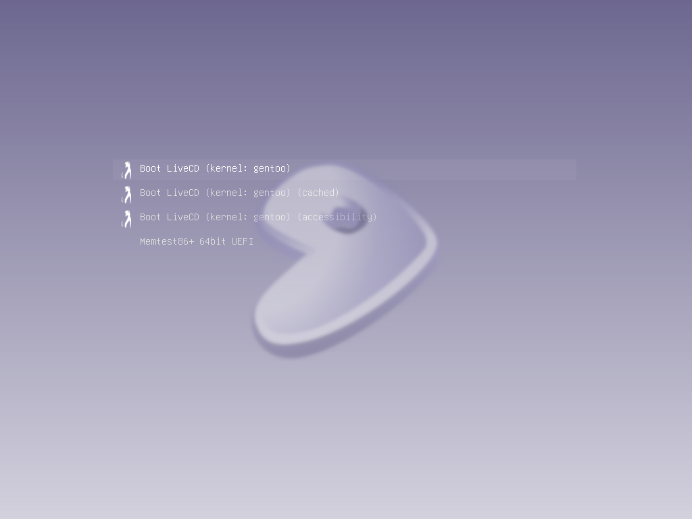
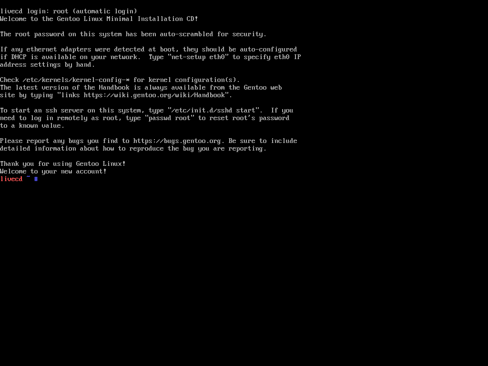
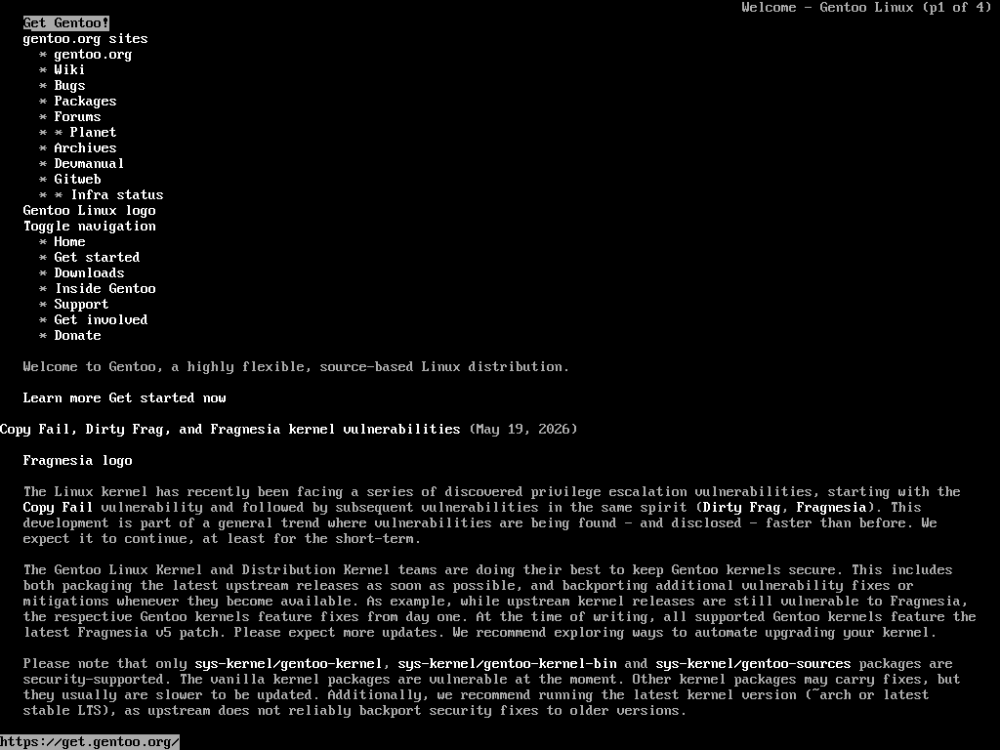
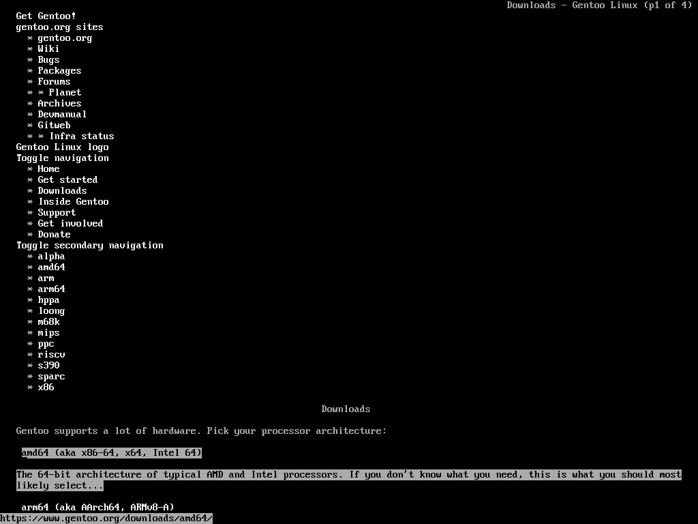
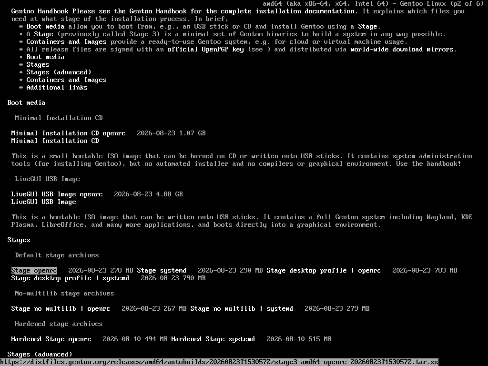
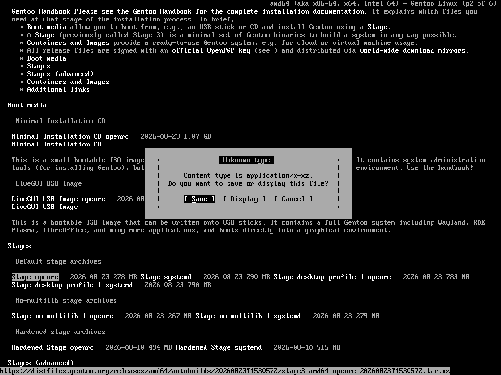
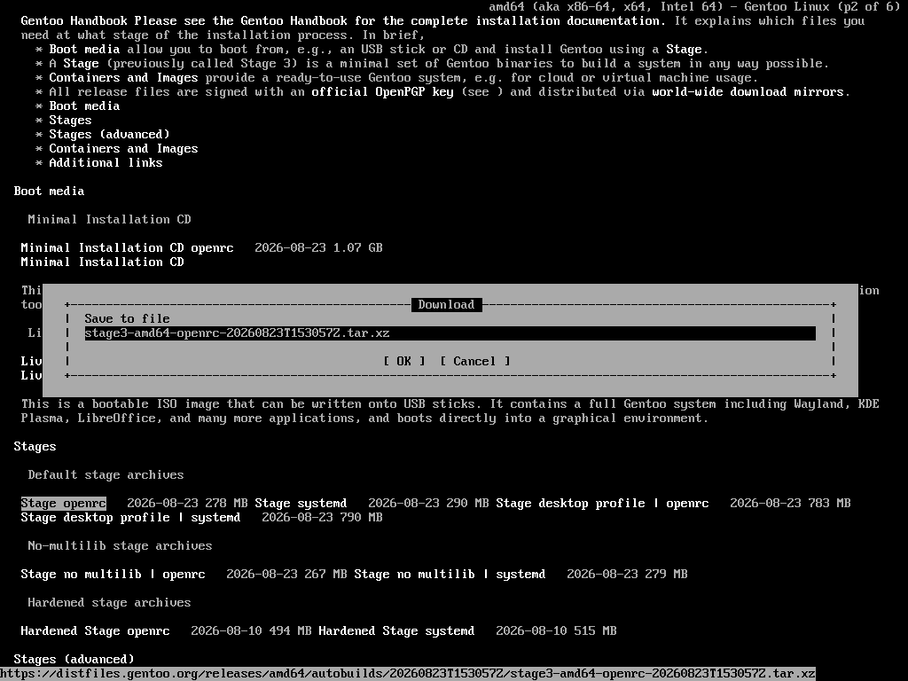
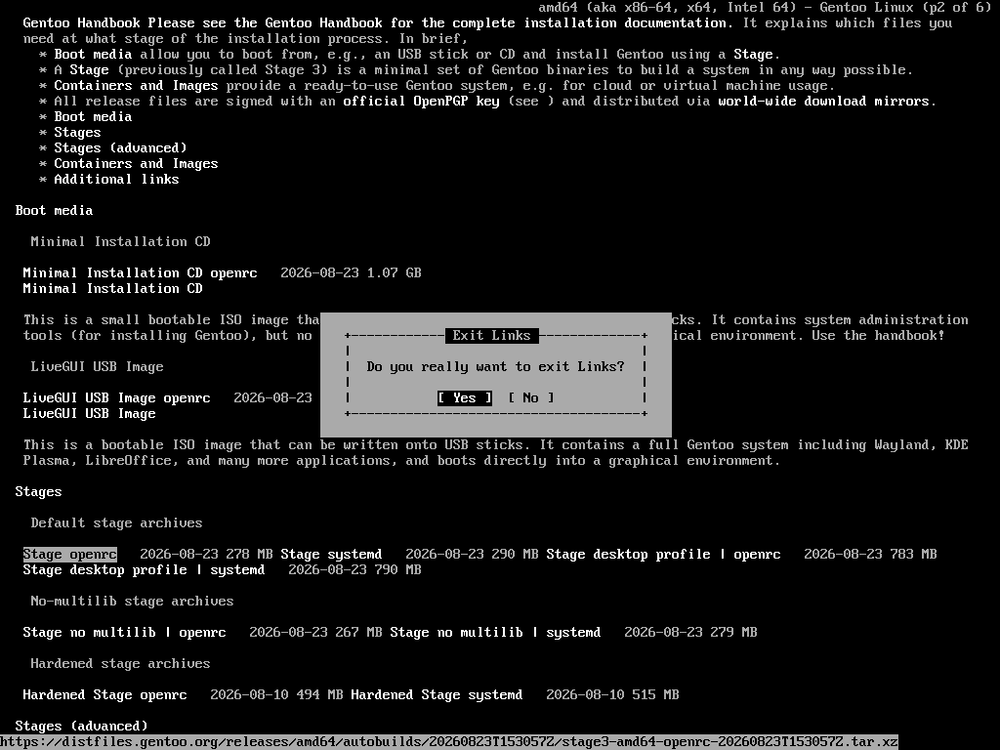

# **Gentoo Linux (x86_64) - installation guide (EFI)**

---

## Preparing for the installation:
### 1. Download Gentoo boot media (amd64) - Minimal Installation CD
### 2. Unpack the *.iso file via Rufus, BalenaEtcher, etc. (or copy to your USB drive with Ventoy)
### 3. Disable Secure Boot in the BIOS

---

## Booting:
### 1. Boot into Gentoo LiveCD system (select its *.iso file in Ventoy)
### 
### (if the keymap is asked, press Enter)
### 3. If the terminal has appeared, congrats! You are in the LiveCD system
### 
### (to clear the terminal, type `clear`)

---

# Partition the disks
## 1. Scan your disks with `lsblk`:
```commandline
NAME  MAJ:MIN RM    SIZE RO TYPE MOUNTPOINTS
loop0   7:0    0  894.2M  1 loop /run/rootfsbase
sda     8:0    0     32G  0 disk 
sr0    11:0    1 1023.3M  1 rom  /run/initramfs/live
```
### my disk is `sda` with 32 GiB (if you use NVMe, it can be labeled as `nvme0n1`)
## 2. Preparing the disk with `fdisk`:
### Type `fdisk /dev/the_disk_to_be_partitioned`, you'll see:
```commandline
Welcome to fdisk (util-linux 2.42.2).
Changes will remain in memory only, until you decide to write them.
Be careful before using the write command.

Device does not contain a recognized partition table.
Created a new DOS (MBR) disklabel with disk identifier 0x178488fc.

Command (m for help): 
```
### Create a new empty GPT partition table typing with `g`:
```commandline
Command (m for help): g
Created a new GPT disklabel (GUID: 5875D4DA-B876-437F-BF04-4FBE04AB10E5).
```
### Add the first partition (EFI system partition with size of 1 GiB) - `n`:
```commandline
Command (m for help): n
Partition number (1-128, default 1): 
First sector (2048-67108830, default 2048): 
Last sector, +/-sectors or +/-size{K,M,G,T,P} (2048-67108830, default 67106815): +1G

Created a new partition 1 of type 'Linux filesystem' and of size 1 GiB.
```
(press `Enter` on the empty lines)
### Add the second partition (Root partition) - `n`:
```commandline
Command (m for help): n
Partition number (2-128, default 2): 
First sector (2099200-67108830, default 2099200): 
Last sector, +/-sectors or +/-size{K,M,G,T,P} (2099200-67108830, default 67106815): 

Created a new partition 2 of type 'Linux filesystem' and of size 31 GiB.
```
### Edit first partition type - `t`:
```commandline
Command (m for help): t
Partition number (1,2, default 2): 1
Partition type or alias (type L to list all): 1

Changed type of partition 'Linux filesystem' to 'EFI System'.
```
(type `p` to see unconfirmed changes)
### Apply changes - `w`:
```commandline
Command (m for help): w
The partition table has been altered.
Calling ioctl() to re-read partition table.
Syncing disks.
```
## 3. Format the partitions with `mkfs`:
### See your created partitions with `lsblk`:
```commandline
NAME   MAJ:MIN RM    SIZE RO TYPE MOUNTPOINTS
loop0    7:0    0  894.2M  1 loop /run/rootfsbase
sda      8:0    0     32G  0 disk 
├─sda1   8:1    0      1G  0 part 
└─sda2   8:2    0     31G  0 part 
sr0     11:0    1 1023.3M  1 rom  /run/initramfs/live
```
### Type `mkfs.fat -F 32 /dev/efi_system_partition` (mine is /dev/sda1)
### And then `mkfs.ext4 /dev/root_partition` (mine is /dev/sda2)
## 4. Mount the partitions:
### `mkdir --parents /mnt/gentoo`
### `mount /dev/root_partition /mnt/gentoo`
### `mkdir --parents /mnt/gentoo/efi`

---

# Stage file
### Before downloading the stage file, the current directory should be set to the location of the mount used for the install:
```commandline
cd /mnt/gentoo
```
### Verify the current date and time with `date`:
```commandline
livecd /mnt/gentoo # date
Wed Aug 26 09:51:27 UTC 2026
```
### If the displayed date and time is more than few minutes off, it should be updated using one of the following methods:
### Automaticaly - `chronyd -q`
### Manually - `date MMDDhhmmYYYY` syntax (Month, Day, hour, minute and Year)
## 1. Downloading the stage file:
### Type `links gentoo.org`, you'll see:
### 
### Navigate with your arrow keys and apply with `Enter`
### Go to the `Downloads` section, you'll see:
### 
### Choose the `amd64` architecture
### Go under to select `Stage openrc`, press `Enter`:
### 
### Save the file:
### 
### And:
### 
### Press `Enter`
### Then quit typing with `q`:
### 
### Press `Enter`
## 2. Installing a stage file:
### Once the stage file has been downloaded and verified, it can be extracted using `tar`:
### `tar xpvf stage3-*.tar.xz --xattrs-include='*.*' --numeric-owner -C /mnt/gentoo`
### Before extracting verify the options:
* #### `x` extract, instructs tar to extract the contents of the archive.
* #### `p` preserve permissions.
* #### `v` verbose output.
* #### `f` file, provides tar with the name of the input archive.
* #### `--xattrs-include='*.*'` Preserves extended attributes in all namespaces stored in the archive.
* #### `--numeric-owner` Ensure that the user and group IDs of files being extracted from the tarball remain the same as Gentoo's release engineering team intended (even if adventurous users are not using official Gentoo live environments for the installation process).
* #### `-C /mnt/gentoo` Extract files to the root partition regardless of the current directory.
## 3. Configuring compile options:
### Find out how many threads does your cpu have
### Execute `nproc`, you'll see:
```commandline
8
```
(there will be your unique number, remember it)
### Fire up an editor to alter the optimization variables we will discuss hereafter:
### Execute `nano /mnt/gentoo/etc/portage/make.conf`, you'll see:
```commandline
# These settings were set by the catalyst build script that automatically
# built this stage.
# Please consult /usr/share/portage/config/make.conf.example for a more
# detailed example.
COMMON_FLAGS="-O2 -pipe"
CFLAGS="${COMMON_FLAGS}"
CXXFLAGS="${COMMON_FLAGS}"
FCFLAGS="${COMMON_FLAGS}"
FFLAGS="${COMMON_FLAGS}"

# NOTE: This stage was built with the bindist USE flag enabled

# This sets the language of build output to English.
# Please keep this setting intact when reporting bugs.
LC_MESSAGES=C.UTF-8
```
### Navigate with your arrow keys in the editor
### COMMON_FLAGS:
#### Edit COMMON_FLAGS content to `"-O2 -pipe -march=native"`
### MAKEOPTS:
#### Add MAKEOPTS parameter - `MAKEOPTS="-jN -lK"`
#### where `N` - min(threads, RAM / 2GB), `K` - threads (`nproc`)
#### Edit MAKEOPTS content referring to your values (for example `MAKEOPTS="-j8 -l8"`)
#### If you want to increase the values, proceed with caution
### USE flags:
#### Add USE parameter with the content - `USE="-systemd"`
### ACCEPT_LICENSE:
#### Add ACCEPT_LICENSE parameter with the content - `ACCEPT_LICENSE="*"`

### Preview:
```commandline
# These settings were set by the catalyst build script that automatically
# built this stage.
# Please consult /usr/share/portage/config/make.conf.example for a more
# detailed example.
COMMON_FLAGS="-O2 -pipe -march=native"
CFLAGS="${COMMON_FLAGS}"
CXXFLAGS="${COMMON_FLAGS}"
FCFLAGS="${COMMON_FLAGS}"
FFLAGS="${COMMON_FLAGS}"
MAKEOPTS="-j4 -l8"
USE="-systemd"
ACCEPT_LICENSE="*"

# NOTE: This stage was built with the bindist USE flag enabled

# This sets the language of build output to English.
# Please keep this setting intact when reporting bugs.
LC_MESSAGES=C.UTF-8
```
### Press `Ctrl + O`, `Enter`, `Ctrl + X`

---

# Chrooting
## 1. Copy DNS info:
#### This needs to be done to ensure that networking still works even after entering the new environment:
* ### `cp --dereference /etc/resolv.conf /mnt/gentoo/etc/`
## 2. Mount the necessary filesystems:
* ### `arch-chroot /mnt/gentoo`
## 3. Entering the new environment:
* ### `export PS1="(chroot) ${PS1}"`
## 4. Preparing for a bootloader:
* ### `mount /dev/efi_system_partition /efi`

---

# Configuring Portage
## 1. Syncing:
* ### `emerge-webrsync`
## 2. Choosing the right profile:
#### A profile is a building block for any Gentoo system. It locks the system to a certain range of package versions.
* ### Execute `eselect profile list`, you'll see:
```commandline
Available profile symlink targets:
  [1]   default/linux/amd64/23.0 *
  [2]   default/linux/amd64/23.0/desktop
  [3]   default/linux/amd64/23.0/desktop/gnome
  [4]   default/linux/amd64/23.0/desktop/plasma
```
#### The output of the command is just an example and evolves over time.
* ### Execute `eselect profile set 1`
## 3. CPU_FLAGS:
#### This is used to configure the build to compile in specific assembly code or other intrinsics.
* ### `emerge --ask --oneshot app-portage/cpuid2cpuflags`
* ### `echo "*/* $(cpuid2cpuflags)" > /etc/portage/package.use/00cpu-flags`
## 4. VIDEO_CARDS:
#### To configure the system correctly the user needs to first unset the preset video cards with VIDEO_CARDS: -* then set the correct card for that system.
```commandline
*/* VIDEO_CARDS: -* <GPU DRIVER NAME>
```
| GPU                                 | VIDEO_CARDS                    |
|-------------------------------------|--------------------------------|
| (Official) Nvidia Maxwell and newer | `nvidia`                       |
| Nouveau Nvidia Supported list       | `nouveau`                      |
| AMD since Sea Islands               | `amdgpu radeonsi`              |
| Intel Nehalem and newer             | `intel`                        |
| Intel Gen 2 and 3                   | `intel i915`                   |
| QEMU/KVM                            | `virgl`                        |
| WSL                                 | `d3d12`                        |
#### Below is a few examples of a properly set package.use for VIDEO_CARDS:
#### `*/* VIDEO_CARDS: -* amdgpu radeonsi` <- AMD example
#### `*/* VIDEO_CARDS: -* intel` <- Intel example
#### `*/* VIDEO_CARDS: -* nvidia` <- Nvidia example
#### If you have hybrid graphics like `Intel + NVIDIA`, `AMD + NVIDIA` and so on:
#### `*/* VIDEO_CARDS: -* intel nvidia`
#### `*/* VIDEO_CARDS: -* amdgpu radeonsi nvidia`
#### ... etc.
### So, execute with your settings:
* ### `echo '*/* VIDEO_CARDS: -* <GPU DRIVER NAME>' > /etc/portage/package.use/00video_cards`
## 5. Syncing again:
* ### `emerge --sync`

---

# Updating the @world set (System update):
## 1. Update the system:
* ### `emerge --ask --verbose --update --deep --newuse @world`
#### wait until the proccess completes 
## 2. Remove obsolete packages:
* ### `emerge --ask --depclean`

---

# Timezone
### Select the timezone for the system. Look for the available timezones in `/usr/share/zoneinfo/`:
* ### `ls /usr/share/zoneinfo`
### Suppose the timezone of choice is Europe/Brussels
### To select this timezone, a symlink can be created from this zoneinfo file to /etc/localtime:
* ### `ln -sf ../usr/share/zoneinfo/Europe/Brussels /etc/localtime`

---

# Configure locales
## 1. Locale generation:
### Execute `nano /etc/locale.gen`, you'll see:
```commandline
# This file defines which locales to incorporate into the glibc locale archive.
# See the locale.gen(5) and locale-gen(8) man pages for more details.

# aa_DJ            # Afar (Djibouti)
# aa_ER            # Afar (Eritrea)
# aa_ET            # Afar (Ethiopia)
# af_ZA            # Afrikaans (South Africa)
# agr_PE           # Aguaruna (Peru)
# ak_GH            # Akan (Ghana)
# am_ET            # Amharic (Ethiopia)
# an_ES            # Aragonese (Spain)
# anp_IN           # Angika (India)
# ar_AE            # Arabic (United Arab Emirates)
# ar_BH            # Arabic (Bahrain)
# ar_DZ            # Arabic (Algeria)
# ar_EG            # Arabic (Egypt)
# ar_IN            # Arabic (India)
# ar_IQ            # Arabic (Iraq)
```
### Go down and find:
```commandline
# en_US            # American English (United States)
```
### Uncomment it:
```commandline
en_US            # American English (United States)
```
### Press `Ctrl + O`, `Enter`, `Ctrl + X`
### Execute `locale-gen`
## 2. Locale selection:
### Execute `eselect locale list`, you'll see:
```commandline
Available targets for the LANG variable:
  [1]   C
  [2]   C.UTF-8 *
  [3]   POSIX
  [4]   en_US.UTF-8
  [ ]   (free form)
```
### With `eselect locale set <NUMBER>`, the correct locale can be selected:
* ### `eselect locale set 4`
### Now reload the environment:
* ### `env-update && source /etc/profile && export PS1="(chroot) ${PS1}"`

---

# *50% is complete! Keep it up :)*

---

# Installing firmware and microcode
## 1. Firmware:
### Most wireless cards and GPUs require firmware to function.
* ###  `emerge --ask sys-kernel/linux-firmware`
* ### `emerge --ask sys-firmware/sof-firmware`
## 2. Microcode:
### Microcode for Intel CPUs can be found within the `sys-firmware/intel-microcode` package:
* ### `emerge --ask sys-firmware/intel-microcode`
### Microcode updates for AMD CPUs are distributed within the aforementioned `sys-kernel/linux-firmware` package:
* ### it's already installed :)

---

# Kernel
## 1. Downloading:
* ### `emerge --ask sys-kernel/gentoo-sources`
## 2. Choosing the installed kernel:
### Execute `eselect kernel list`, you'll see:
```commandline
Available kernel symlink targets:
  [1]   linux-6.18.41-gentoo
```
### Execute `eselect kernel set 1`
## 3. Installing the kernel:
* ### `emerge --ask sys-kernel/genkernel`
* ### `genkernel all`

---

# Filesystem information
## 1. Creating the fstab file:
* ### Execute `nano /etc/fstab`, you'll see:
```commandline
# /etc/fstab: static file system information.
#
# See the manpage fstab(5) for more information.
#
# NOTE: The root filesystem should have a pass number of either 0 or 1.
#       All other filesystems should have a pass number of 0 or greater than 1.
#
# NOTE: Even though we list ext4 as the type here, it will work with ext2/ext3
#       filesystems.  This just tells the kernel to use the ext4 driver.
#
# NOTE: You can use full paths to devices like /dev/sda3, but it is often
#       more reliable to use filesystem labels or UUIDs. See your filesystem
#       documentation for details on setting a label. To obtain the UUID, use
#       the blkid(8) command.

# <fs>                  <mountpoint>    <type>          <opts>          <dump> <pass>

#LABEL=boot             /boot           ext4            defaults        1 2
#UUID=58e72203-57d1-4497-81ad-97655bd56494              /               xfs             defaults                0 1
#LABEL=swap             none            swap            sw              0 0
#/dev/cdrom             /mnt/cdrom      auto            noauto,ro       0 0
```
### Add first line with your `/dev/efi_system_partition`: (/dev/sda1 for example):
```commandline
/dev/sda1               /boot/efi       vfat            defaults        0 2
```
### Add second line with your `/dev/root_partition`: (/dev/sda2 for example):
```commandline
/dev/sda2               /               ext4            noatime         0 1
```
### Preview:
```commandline
# /etc/fstab: static file system information.
#
# See the manpage fstab(5) for more information.
#
# NOTE: The root filesystem should have a pass number of either 0 or 1.
#       All other filesystems should have a pass number of 0 or greater than 1.
#
# NOTE: Even though we list ext4 as the type here, it will work with ext2/ext3
#       filesystems.  This just tells the kernel to use the ext4 driver.
#
# NOTE: You can use full paths to devices like /dev/sda3, but it is often
#       more reliable to use filesystem labels or UUIDs. See your filesystem
#       documentation for details on setting a label. To obtain the UUID, use
#       the blkid(8) command.

# <fs>                  <mountpoint>    <type>          <opts>          <dump> <pass>

#LABEL=boot             /boot           ext4            defaults        1 2
#UUID=58e72203-57d1-4497-81ad-97655bd56494              /               xfs             defaults                0 1
#LABEL=swap             none            swap            sw              0 0
#/dev/cdrom             /mnt/cdrom      auto            noauto,ro       0 0
/dev/sda1               /boot/efi       vfat            defaults        0 2
/dev/sda2               /               ext4            noatime         0 1
```
### Press `Ctrl + O`, `Enter`, `Ctrl + X`

---

# Networking information
## 1. Hostname:
### Name your pc :) - `echo <NAME> > /etc/hostname`
## 2.1 Network (Ethernet using):
* ### `emerge --ask net-misc/dhcpcd`
* ### `rc-update add dhcpcd default`
## 2.2 Network (WiFi using):
### First add the networkmanager USE flag to `/etc/portage/make.conf`: 
```commandline
...
USE="... networkmanager"
...
```
* ### Execute `nano /etc/portage/make.conf` and edit
### And also:
* ### `echo "net-wireless/wpa_supplicant dbus" > /etc/portage/package.use/networkmanager`
### Next, emerge the package:
* ### `emerge --ask net-misc/networkmanager`
### Finally, enable the service to start at boot time:
* ### `rc-update add NetworkManager default`

---

# System information
## 1. Root password:
### Set the root password using the passwd command -`passwd`
### Symbols you type won't be shown for security reasons
### You have to type the password twice

---

# Cron daemon
## Executes commands on scheduled intervals.
* ## `emerge --ask sys-process/cronie`
* ## `rc-update add cronie default`

---

# File indexing
## In order to index the file system to provide faster file location capabilities
* ## `emerge --ask sys-apps/mlocate`

---

# Shell completion
* ## `emerge --ask app-shells/bash-completion`

---

# Time synchronization
* ## `emerge --ask net-misc/chrony`
* ## `rc-update add chronyd default`

---

# Filesystem tools
* ## `emerge --ask sys-fs/e2fsprogs`
* ## `emerge --ask sys-fs/dosfstools`
* ## `emerge --ask sys-block/io-scheduler-udev-rules`

---

# 90% Done!

---

# Configuring the bootloader (GRUB)
## 1. Prepare:
* ### Add GRUB_PLATFORMS flag to `/etc/portage/make.conf`:
```commandline
...
GRUB_PLATFORMS="efi-64"
...
```
* ### Execute `nano /etc/portage/make.conf` and edit
## 2. Download:
* ### `emerge --ask sys-boot/grub`
## 3. Install:
* ### `grub-install --efi-directory=/efi --removable`
## 4. Configure:
* ### `grub-mkconfig -o /boot/grub/grub.cfg`

---

# Rebooting the system
* ## `exit`
* ## `cd`
* ## `umount -l /mnt/gentoo/dev{/shm,/pts,}`
* ## `umount -R /mnt/gentoo`
* ## `reboot`

---

# Portage maintenance
* ## `emerge --ask app-portage/gentoolkit`
## For cleaning old source tarballs, use:
* ## `eclean-dist`
## For cleaning old binpkgs, use:
* ## `eclean-pkg`

---

# User administration
## Adding a user for daily use:
* ## `useradd -m -G users,wheel,audio -s /bin/bash <USER>`
* ## `passwd <USER>`

---

# It's done!
I hope this handbook will receive updates from my side as your system from `emerge` :)